# Using bottle with Tetration

This guide covers how to use bottle to create a 3 tier application that can be used within Tetration

The application (known as "scenario" in bottle terminology),

```c
[web]--[80]-->[app]--[3306]-->[db]
```

* The `web` tier will submit a http request to the `app` tier on port `80`
* The `app` tier will process the http request and send a query to the `db` tier on port `3306`

The scenario will run indefinitely looping this traffic pattern until deleted.

The payload sent by bottle is **not** actual application traffic, it is random bytes,
however, that is not the point of bottle; as Tetration is only concerned with layers 1-4, bottle can
create the impression of real application traffic as desired - without actually having to run the real
application, which can be complicated and time consuming to setup and maintain, and, resource intensive to scale.

## Setup 

### Software

You do not need much to run bottle, any relatively recent installation of Kubernetes, Helm, and Docker will be sufficient.

In this example the software versions are:

* `Kubernetes 1.11.0` 
* `Helm 2.9.1` 
* `Docker 1.13.1`

### Scale

Bottle scales well with minimal resources. You do not need a heavily provisioned kube environment to get started.

If you are new to containers, you may want to try the kube support in docker and run the examples on your laptop.

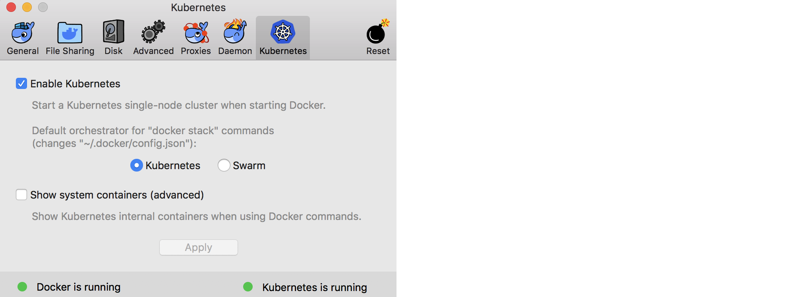

On a 2016 MacBook Pro 15" (16GB RAM) bottle could scale to around 60 pods.

In this example, a larger 8 node cluster will be used to demonstrate scale, comfortably running over 1000 pods.


## Guide

### Deploying Sensors

Download the CentOS 7.5 enforcer sensor from the target Tetration cluster

Generate an API key with the following credentials:

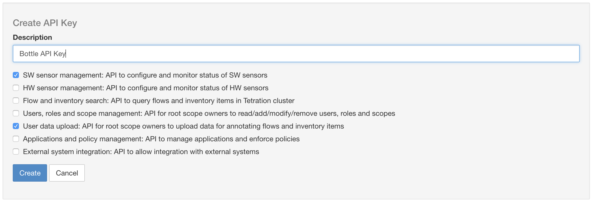

Create the docker image

```bash
> git clone https://cto-github.cisco.comcom/tigarner/bottle

> cd bottle

> cp ~/Downloads/tet-sensor-2.3.1.45-1.el7-pliny.enforcer.x86_64.rpm sensor/sensor.rpm

> cp ~/Downloads/api_credentials.json sensor/

> docker build -f sensor/Dockerfile -t bottle:pliny .
```

Tag the image and push to the docker registry

```bash
> docker tag bottle:pliny tigarner/bottle:pliny

> docker push tigarner/bottle:pliny
```

Observe the "3tier" scenario, it's a simple YAML file

For more details, see the article on [Scenarios](SCENARIOS.md)

```yaml
# scenarios/3tier.yaml
scenario: 3tier
ships:
    web: 
        replicas: 3
        clients:
        - app:80
    app: 
        replicas: 3
        servers:
        - 80
        clients:
        - db:3306
    db:
        replicas: 3
        servers:
        - 3306
```

The parameters passed to helm are 

* `install` - this will deploy a new instance of the scenario
* `-f scenarios/3tier.yaml` - the path to the scenario file
* `--set image=tigarner/bottle:pliny` - the image to pull and deploy 
* `--set scope=Bottle` - the root scope annotations will be placed under
* `./bottle` - use the helm chart found in the `bottle` directory

```
> helm install -f scenarios/3tier.yaml --set image=tigarner/bottle:pliny --set scope=Bottle ./bottle

NAME:   pondering-octopus
LAST DEPLOYED: Fri Jul  6 22:53:18 2018
NAMESPACE: default
STATUS: DEPLOYED

RESOURCES:
==> v1/ConfigMap
NAME          DATA  AGE
3tier-config  3     1s

==> v1/Service
NAME  TYPE       CLUSTER-IP  EXTERNAL-IP  PORT(S)   AGE
db    ClusterIP  None        <none>       3306/TCP  1s
web   ClusterIP  None        <none>       <none>    1s
app   ClusterIP  None        <none>       80/TCP    1s

==> v1beta1/Deployment
NAME  DESIRED  CURRENT  UP-TO-DATE  AVAILABLE  AGE
db    3        3        3           0          1s
web   3        3        3           0          1s
app   3        3        3           0          1s

==> v1/Pod(related)
NAME                  READY  STATUS             RESTARTS  AGE
db-5d4f85bc7c-65lcr   0/3    ContainerCreating  0         1s
db-5d4f85bc7c-7x5nl   0/3    ContainerCreating  0         1s
db-5d4f85bc7c-82fpf   0/3    ContainerCreating  0         1s
web-79b7fff49f-fp7d9  0/3    ContainerCreating  0         1s
web-79b7fff49f-ks2rc  0/3    ContainerCreating  0         1s
web-79b7fff49f-zp2jm  0/3    ContainerCreating  0         1s
app-58cd74b8c8-92qvn  0/3    ContainerCreating  0         1s
app-58cd74b8c8-qnwtn  0/3    ContainerCreating  0         1s
app-58cd74b8c8-wm2js  0/3    ContainerCreating  0         1s


NOTES:
Installed bottle scenario 3tier

Your release is named pondering-octopus.

To learn more about the release, try:

  $ helm status pondering-octopus
  $ helm get pondering-octopus

To delete the release:

  $ helm delete pondering-octopus
```

In the above output you can observe a number of resources have been created

Each ship (web, app, db) will be created as a deployment with three replicas as defined in the scenario
```
==> v1beta1/Deployment
NAME  DESIRED  CURRENT  UP-TO-DATE  AVAILABLE  AGE
db    3        3        3           0          1s
web   3        3        3           0          1s
app   3        3        3           0          1s
```

Each replica will run a separator traffic generator, sensor, and enforcer container
```
==> v1/Pod(related)
NAME                  READY  STATUS             RESTARTS  AGE
db-5d4f85bc7c-65lcr   0/3    ContainerCreating  0         1s
db-5d4f85bc7c-7x5nl   0/3    ContainerCreating  0         1s
db-5d4f85bc7c-82fpf   0/3    ContainerCreating  0         1s
web-79b7fff49f-fp7d9  0/3    ContainerCreating  0         1s
web-79b7fff49f-ks2rc  0/3    ContainerCreating  0         1s
web-79b7fff49f-zp2jm  0/3    ContainerCreating  0         1s
app-58cd74b8c8-92qvn  0/3    ContainerCreating  0         1s
app-58cd74b8c8-qnwtn  0/3    ContainerCreating  0         1s
app-58cd74b8c8-wm2js  0/3    ContainerCreating  0         1s
```

>Note: in this output there are *three replicas per deployment (one replica per row)* and each replica
>is made up of three containers (e.g. 0/3 READY)


The services will be provided by the named ships
```
==> v1/Service
NAME  TYPE       CLUSTER-IP  EXTERNAL-IP  PORT(S)   AGE
db    ClusterIP  None        <none>       3306/TCP  1s
web   ClusterIP  None        <none>       <none>    1s
app   ClusterIP  None        <none>       80/TCP    1s
```


### Validating Sensors

Each pod will run a unique sensor, which will register with Tetration as an enforcement sensor

The reported IPs will be local to the Kube cluster and may be different depending on your setup, in this example they are in `192.168.0.0/16`

If the sensors do not show up, you may need to check the status of the pods using `kubectl get pods -l scenario=3tier` or `helm status pondering-octopus`.

If all pods are running and the sensors do not appear, you may need to use Remote VRF configuration to assign sensors to the right Tenant. 

Assuming no other NAT, you can use the public IPs of the kube nodes as the source IP for the Remote VRF configuration

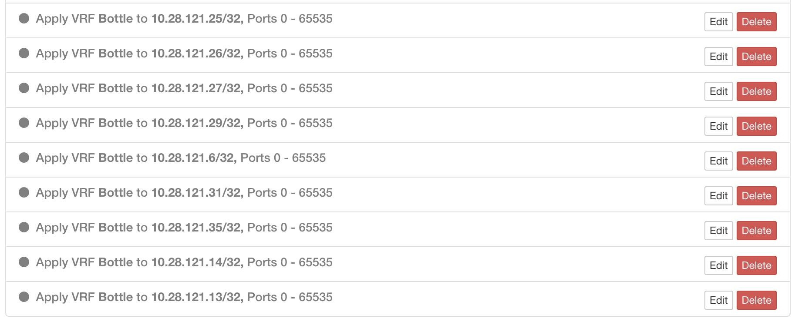

All 9 pods are successfully connected and sending telemetry

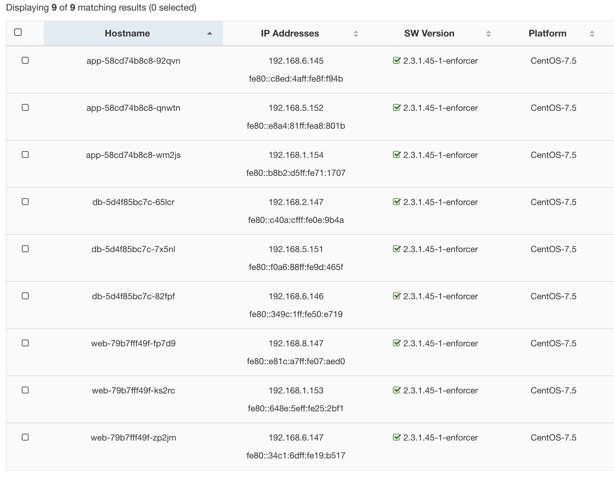

After a few minutes each agent will have a host profile page, where you can see four annotations have been created

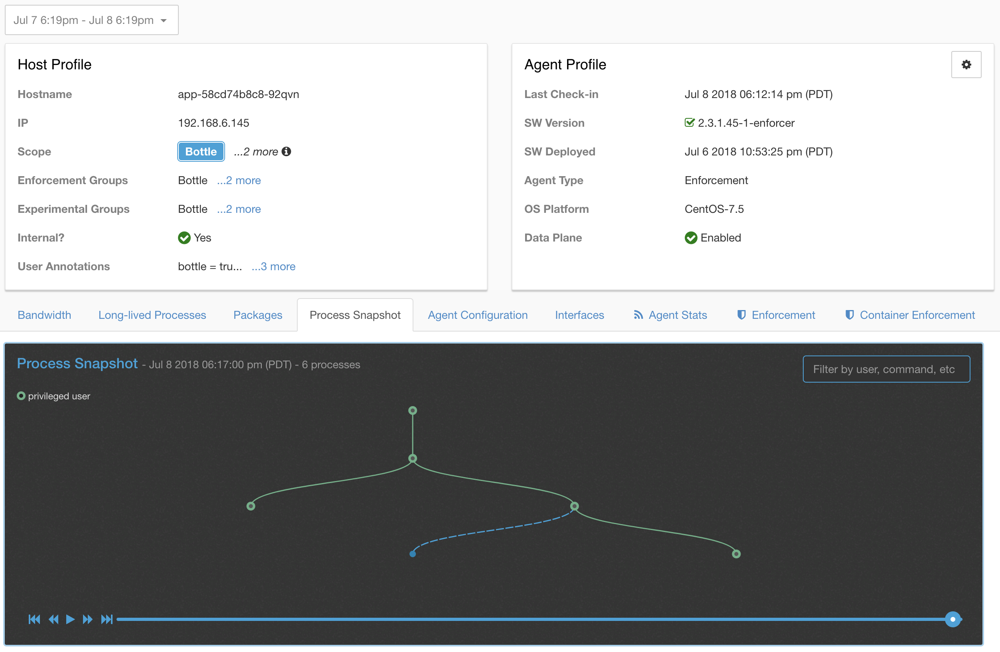

You can also view the status of the bottle resources on the Kubernetes dashboard

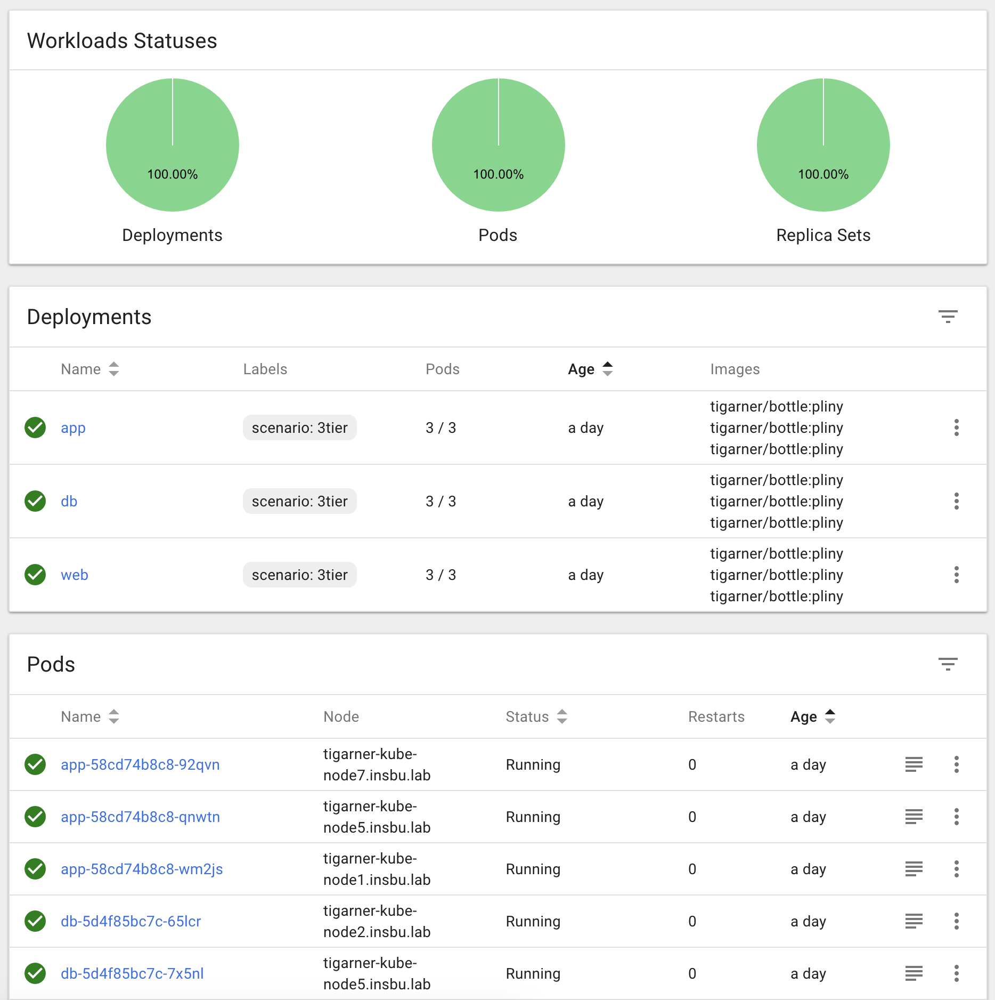

### Annotations and Scopes

Each bottle host will get four annotations, we can search the inventory for `bottle_lifecycle=active and OS=CentOS`

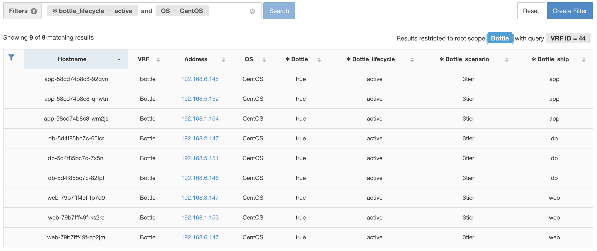

>Take note: when a pod terminates, it will attempt to annotate itself with bottle_lifecycle=terminated and delete the sensor registration, however, if for any reason
>a pod is unexpectedly terminated it may fail to update the annotation or delete the sensor registration. After some time you may end up with stale annotations and/or
>stale agents registered. You may want to use qualifiers like `OS=CentOS` to prune out inactive annotations: if the agent is successfully 
>unregistered the host profile will soon lose the OS metadata. You may want to search the agent list for sensors that have not checked in
>recently and prune any stale bottle sensor entries, if they exist.

You can now quite easily create a scope tree to classify bottle endpoints using Annotations


### Application Workspace

Tetration will now be collecting data and attributing it to the created scope tree continuously. 

If you want to run ADM, you will need to leave the system running for 6 hours or more now.

If you want to write policy by hand, you can use the annotations to create dynamic clusters right now

- jump to [Dynamic Policy](#dynamic-policy) for some tips.

Create the application workspace for the 3tier scenario, and make sure to select Dynamic Mode.


To run ADM, the settings can left as default, the only change of note is I created two filters restricted to the "Bottle" scope to represent the internal kubernetes DNS and Tetration IPs.

>
>Both filters are marked as restricted, the workspace for the scope "Bottle" has been marked as primary, and the filters are marked as public services.

Submit the ADM run and let Tetration analyse the flow and process data to form an application policy 

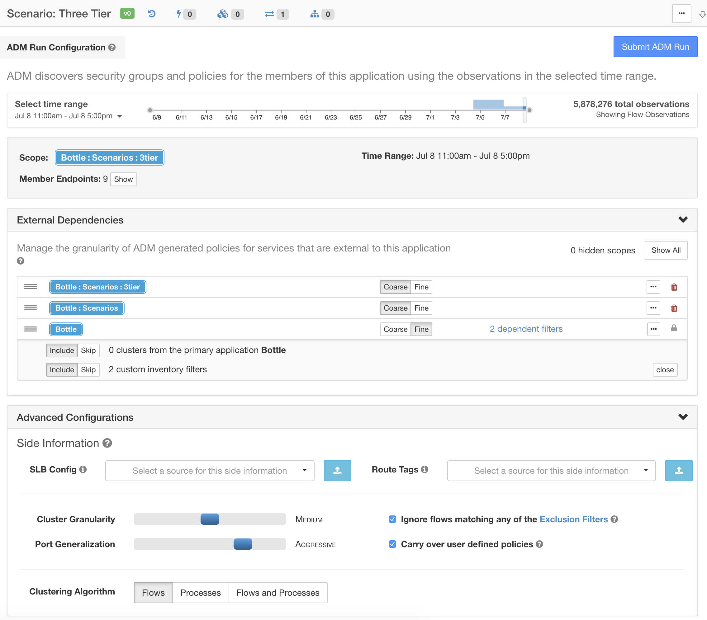

If everything goes as expected, you should see ADM results that are exactly in line with the Scenario specification

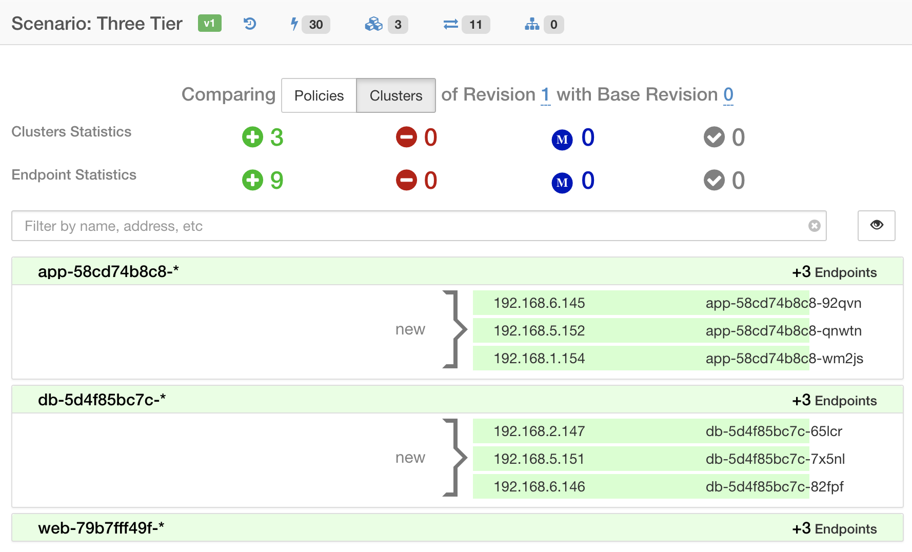

The clusters will be named similarly to the deployment names; rename clusters for clarity if desired

Policy will be created for infra flows (Kube, Tetration) - if you do not want them to show up use an exclusion filter

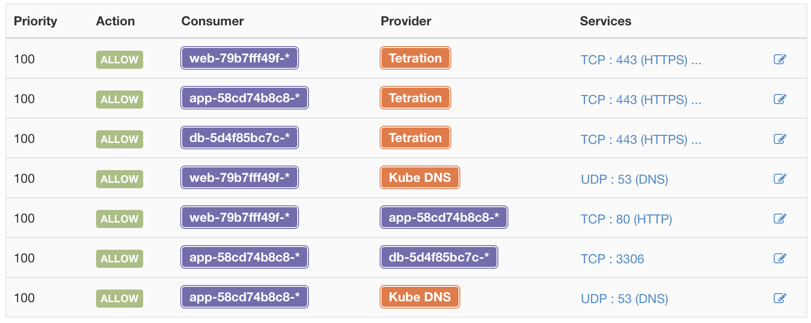

### Analysing Policy

Now that the application policy has been discovered, we can test the policy against the constantly generated traffic to ensure we won't break anything

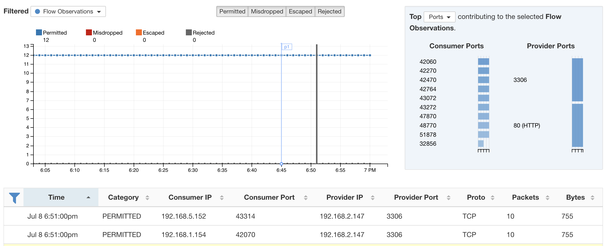

### Enforcing Policy

All bottle pods can have policy enforced in them! Yes, even though it is a container there is a full local instance of iptables

>Note: bottle uses full (e.g. for VMs) enforcement sensors INSIDE the container image. This is NOT the recommended way to enforce policy when 
>using containers with Tetration. If you are using Tetration to enforce policy in normal application containers please see the container 
>enforcement documentation to understand how to install and use the feature.

After clicking enforce in the Tetration UI, within a minute or so, you can get the iptable output from any of the running pods:

```
> kubectl exec app-58cd74b8c8-qnwtn -c enforcer -- iptables -L -n

Chain INPUT (policy DROP)
target           prot opt source               destination
TA_GOLDEN_INPUT  all  --  0.0.0.0/0            0.0.0.0/0
TA_INPUT         all  --  0.0.0.0/0            0.0.0.0/0

Chain FORWARD (policy ACCEPT)
target     prot opt source               destination

Chain OUTPUT (policy DROP)
target            prot opt source               destination
TA_GOLDEN_OUTPUT  all  --  0.0.0.0/0            0.0.0.0/0
TA_OUTPUT         all  --  0.0.0.0/0            0.0.0.0/0

Chain TA_GOLDEN_INPUT (1 references)
target     prot opt source               destination
ACCEPT     all  --  0.0.0.0/0            0.0.0.0/0
ACCEPT     tcp  --  0.0.0.0/0            0.0.0.0/0            match-set ta_<snip> src multiport sports 5660 ctstate ESTABLISHED
ACCEPT     tcp  --  0.0.0.0/0            0.0.0.0/0            match-set ta_<snip> src multiport sports 5640 ctstate ESTABLISHED
ACCEPT     tcp  --  0.0.0.0/0            0.0.0.0/0            match-set ta_<snip> src multiport sports 443 ctstate ESTABLISHED
RETURN     all  --  0.0.0.0/0            0.0.0.0/0

Chain TA_GOLDEN_OUTPUT (1 references)
target     prot opt source               destination
ACCEPT     all  --  0.0.0.0/0            0.0.0.0/0
ACCEPT     tcp  --  0.0.0.0/0            0.0.0.0/0            match-set ta_<snip> dst multiport dports 5660 ctstate NEW,ESTABLISHED
ACCEPT     tcp  --  0.0.0.0/0            0.0.0.0/0            match-set ta_<snip> dst multiport dports 5640 ctstate NEW,ESTABLISHED
ACCEPT     tcp  --  0.0.0.0/0            0.0.0.0/0            match-set ta_<snip> dst multiport dports 443 ctstate NEW,ESTABLISHED
RETURN     all  --  0.0.0.0/0            0.0.0.0/0

Chain TA_INPUT (1 references)
target     prot opt source               destination
ACCEPT     udp  --  0.0.0.0/0            0.0.0.0/0            match-set ta_<snip> src match-set ta_<snip> dst multiport sports 53 ctstate ESTABLISHED
ACCEPT     tcp  --  0.0.0.0/0            0.0.0.0/0            match-set ta_<snip> src match-set ta_<snip> dst multiport sports 3306 ctstate ESTABLISHED
ACCEPT     tcp  --  0.0.0.0/0            0.0.0.0/0            match-set ta_<snip> src match-set ta_<snip> dst multiport dports 80 ctstate NEW,ESTABLISHED
ACCEPT     tcp  --  0.0.0.0/0            0.0.0.0/0            match-set ta_<snip> src match-set ta_<snip> dst multiport sports 443,5660 ctstate ESTABLISHED
RETURN     all  --  0.0.0.0/0            0.0.0.0/0

Chain TA_OUTPUT (1 references)
target     prot opt source               destination
ACCEPT     udp  --  0.0.0.0/0            0.0.0.0/0            match-set ta_<snip> src match-set ta_<snip> dst multiport dports 53 ctstate NEW,ESTABLISHED
ACCEPT     tcp  --  0.0.0.0/0            0.0.0.0/0            match-set ta_<snip> src match-set ta_<snip> dst multiport dports 3306 ctstate NEW,ESTABLISHED
ACCEPT     tcp  --  0.0.0.0/0            0.0.0.0/0            match-set ta_<snip> src match-set ta_<snip> dst multiport sports 80 ctstate ESTABLISHED
ACCEPT     tcp  --  0.0.0.0/0            0.0.0.0/0            match-set ta_<snip> src match-set ta_<snip> dst multiport dports 443,5660 ctstate NEW,ESTABLISHED
RETURN     all  --  0.0.0.0/0            0.0.0.0/0
```

### Dynamic Policy

What happens if we scale the scenario to 5, 10, 100, 1000 replicas? Our policy intent stays the same, but the workloads it applies to must dynamically change
to correctly classify and apply policy to the new endpoints.

In Tetration we can convert the regular clusters into dynamic clusters based on the bottle annotations:

Here, detecting that the "web" cluster can be classified via the `bottle_ship=web` annotation

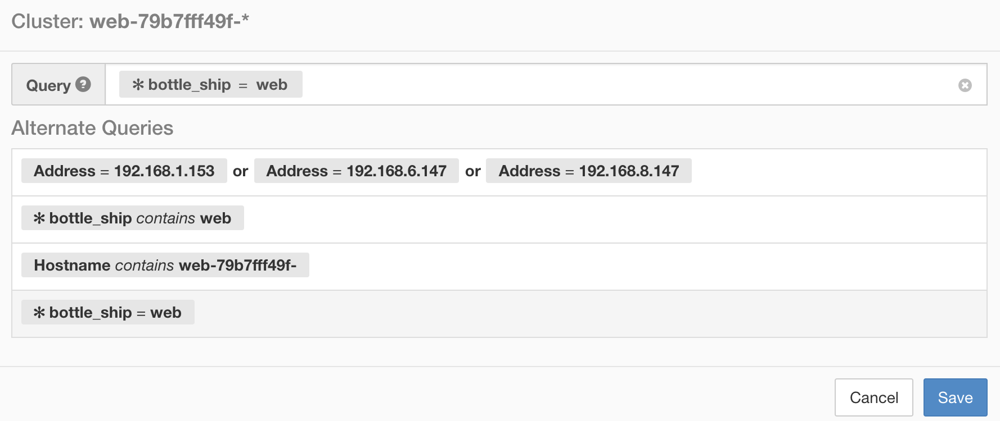

We can then easily scale up the scenario replicas, how about 10:

```
kubectl scale deployment web app db --replicas=10
deployment.extensions "web" scaled
deployment.extensions "app" scaled
deployment.extensions "db" scaled
```

Within a few seconds, the agent count has increased from 9 (3 replicas x 3) to 30 (10 replicas x 3)


Tetration even helped identify the fact that the enforcement rules had not been updated since moving to dynamic policy, and therefore the new endpoints were having
their traffic rejected:


But bottle is supposed be scalable, so what about 350 replicas?!

```
kubectl scale deployment web app db --replicas=350
deployment.extensions "web" scaled
deployment.extensions "app" scaled
deployment.extensions "db" scaled
```

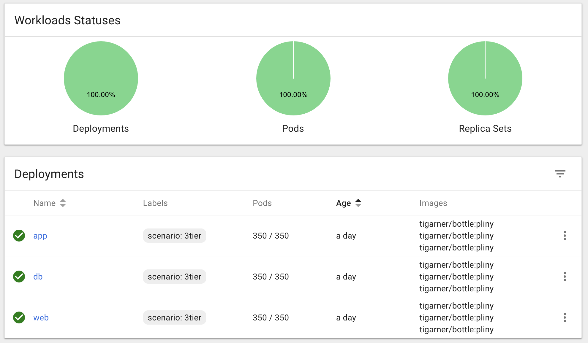

A total of 1,050 agents are seen registered


And the policy analysis graph shows a large spike in flow observations

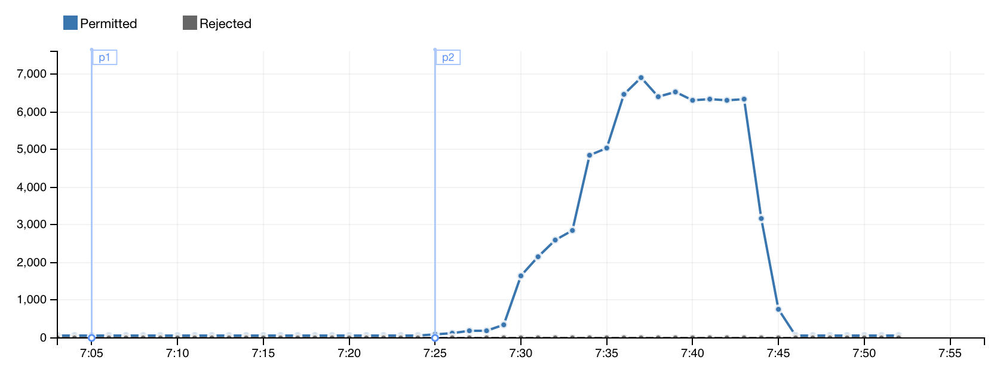

Tetration seamlessly on-boards the new agents, correctly assigns them into the clusters based on annotations, and finally applies the `iptable` security rules, all without any further administrator interaction.

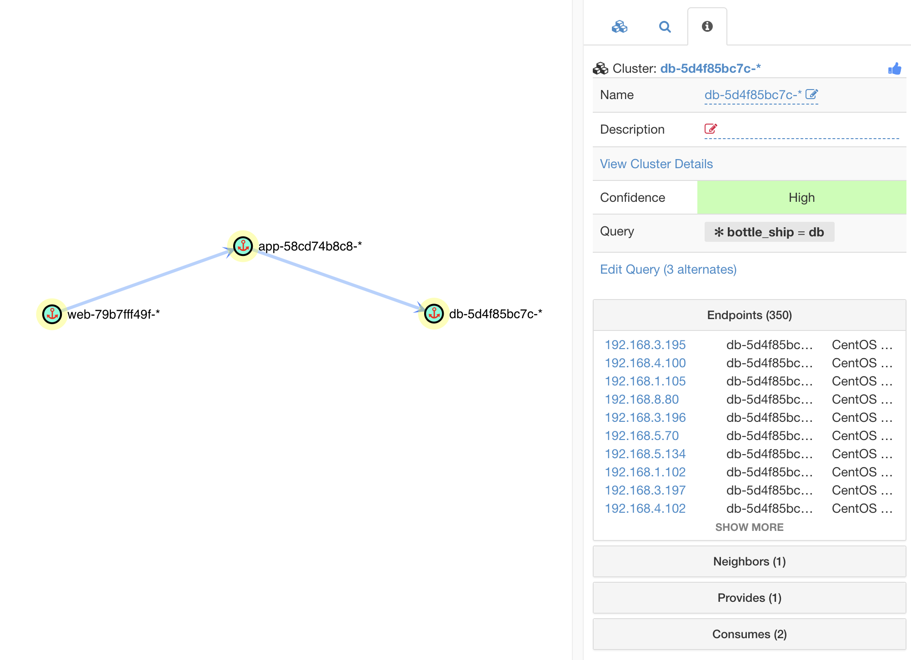

And finally we can scale the application back down to our original three replicas:

```
kubectl scale deployment web app db --replicas=3
deployment.extensions "web" scaled
deployment.extensions "app" scaled
deployment.extensions "db" scaled
```

And policy contracts as necessary

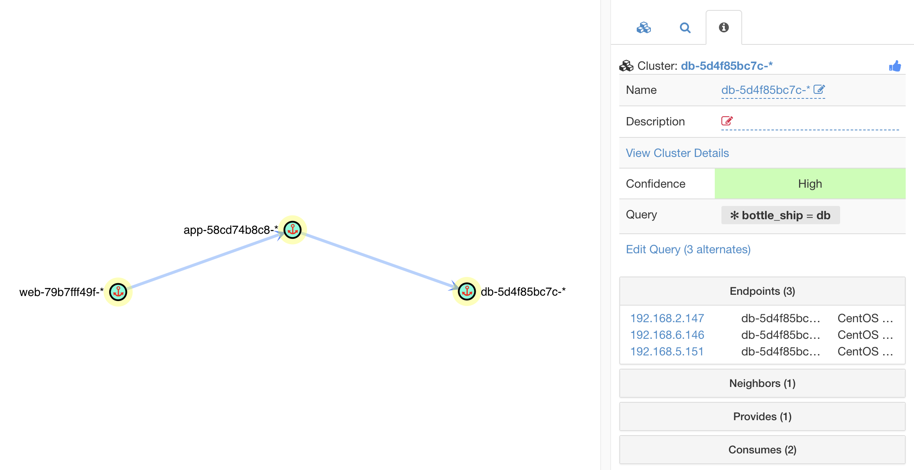

### Cleaning Up

We could now leave the scenario running indefinitely and use this as a stable example setup, or we could choose to tear down the environment and leave no trace.

To remove the scenario, execute the helm command to delete the release name:

```
> helm ls

NAME                    REVISION        UPDATED                         STATUS          CHART           NAMESPACE
pondering-octopus       1               Fri Jul  6 22:53:18 2018        DEPLOYED        bottle-0.1.0    default


> helm delete pondering-octopus
```
